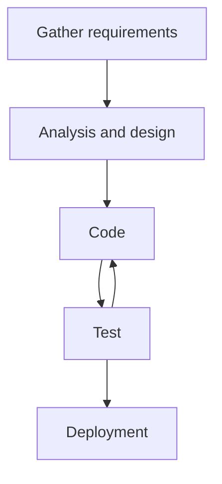
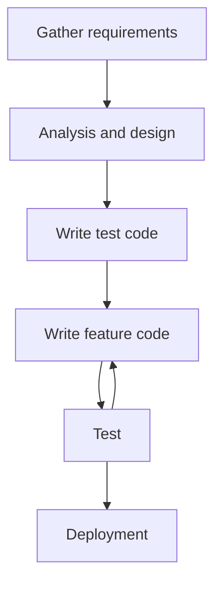

<div markdown="1">

## Download Link
### **Total 2000+ users have downloaded Ara app!**

[**App Store**](https://apps.apple.com/kr/app/ara-for-kaist/id6457209147){:target="_blank"}

[**Google Play**](https://play.google.com/store/apps/details?id=org.sparcs.newara){:target="_blank"}

[**GitHub Repository**](https://github.com/sparcs-kaist/new-ara-app){:target="_blank"}

<div style="display: flex">


</div>

## 1. Key Implementation Requirements

[The web-based Ara frontend and backend have been in service since 1991.](https://sparcs.org/projects/ara/){:target="_blank"} However, there was no **mobile app** for Ara, so I developed one.

The app fully supports both Korean and English.
<div style="display: flex">


</div>

<div style="display: flex">


</div>

- **Login Logic**: Integrate KAIST SSO authentication so that only KAIST students can log in.
- **Post Viewing**: Users should be able to view posts organized by board.

- **Post Creation and Editing**: Users can add and edit posts in HTML format, with support for attachments.
- **Comments**: Enable users to comment on posts.

- **Multilingual Design**: The interface should support both English and Korean.

## 2. Why did I choose Flutter to implement a mobile app?

### 2.1. Pros

- **Previous Experience**: My co-worker [Sang-oh Kim](https://github.com/sangohkim){:target="_blank"} and I have some familiarity with Flutter.

- **Cross-Platform**: Since the app needs to be available on both iOS and Android, Flutter is a good option.

### 2.2. Cons

- **Not a Native app**: Using advanced and the latest native features can be challenging. I rely solely on the Flutter SDK and its latest updates.

- **Relatively Small Flutter Community**: Fewer available libraries and community resources.

## 3. Structure

### 3.1. Code

```
NEW-ARA-APP
├── ios
│   ├── ...
│   └── fastlane
│       ├── Appfile
│       ├── Fastfile
│       ├── README.md
│       └── report.xml
├── android
│   ├── ...
│   └── fastlane
│       ├── Appfile
│       ├── Fastfile
│       ├── README.md
│       ├── newara-fastlane.json
│       ├── report.xml
│       └── upload-keystore.jks
├── assets
│   ├── fonts
│   │   └── ...
│   ├── icons
│   │   └── ...
│   ├── images
│   │   └── ...
│   └── translations
│       ├── en.json
│       └── ko.json
└── lib
    ├── constants
    │   ├── colors_info.dart
    │   └── ...
    ├── main.dart
    ├── models
    │   ├── article_list_action_model.dart
    │   └── ...
    ├── pages
    │   ├── board_list_page.dart
    │   └── ...
    ├── providers
    │   ├── user_provider.dart
    │   └── ...
    ├── translations
    │   ├── codegen_loader.g.dart
    │   └── locale_keys.g.dart
    ├── utils
    │   ├── cache_function.dart
    │   └── ...
    └── widgets
        ├── border_boxes.dart
        └── ...
```

- **CI/CD** is managed by GitHub Actions and [fastlane](https://docs.fastlane.tools/getting-started/cross-platform/flutter/){:target="_blank"}. Deployment keys, such as .jks files, are securely stored in GitHub Secrets.
- **assets/**: It consists of images, fonts, and translations.
- **lib/models/**: It defines the schemas for API requests and responses.
- **lib/pages/**: It contains the structure of pages displayed in the app.
- **lib/providers/**: [Provider](https://pub.dev/packages/provider){:target="_blank"} is an official state management libraries. Each dart file manages an entity's state.
- **lib/widgets/**: It contains reusable, common widgets.

### 3.2. Provider

I used the Provider library to share the same instance across the entire app. It seems like a singleton pattern, but it can also use dependency injection.

**Sample**

```dart
import 'package:flutter/material.dart';
import 'package:provider/provider.dart';
import 'cart_provider.dart';
import 'cart_screen.dart';

void main() {
    runApp(MyApp());
}

class MyApp extends StatelessWidget {
    @override
    Widget build(BuildContext context) {
        return MaterialApp(
            home: MultiProvider(
                providers: [
                    ChangeNotifierProvider(create: (_) => CartProvider()),
                ],
                child: CartScreen(), // CartProvider is only available for CartScreen and its widget tree
            ),
        );
    }
}
```

### 3.3. Role

We divided roles by features.

- [Sang-oh Kim](https://github.com/sangohkim){:target="_blank"}: Responsible for implementing the comment writing system, personal profile editing, scrap system, and CI/CD.
- [Me](https://github.com/skykhs3){:target="_blank"}: Responsible for implementing the post and board view system, login system, and post writing system.

## 4. How I implemented login

The login page is composed of a [WebView](https://pub.dev/packages/webview_flutter){:target="_blank"}. To use the Ara app, users must log in through the SPARCS SSO web page, which serves as a club-based SSO system.

SPARCS SSO authenticates by storing cookies in the web browser, making a WebView essential. This includes cookies like csrftoken and sessionId for user authentication and session maintenance.

Interestingly, **Flutter** allows access to WebView cookies, which could pose a security risk. I'll explain the importance of cookie permissions in a later section.

## 5. How We Implemented Post Creation, Editing, and Viewing
I used [Flutter Quill](https://pub.dev/packages/flutter_quill){:target="_blank"} to implement the HTML editor, and Sang-oh Kim used [WebView](https://pub.dev/packages/webview_flutter){:target="_blank"} to implement the HTML viewer.

We prioritized publisher reliability, points, and latest published date when choosing the libraries.


*pub.dev*

## 6. Troubleshooting with Play Store

### 6.1. Play Store Reviewer's Spam Comments
We gave the Play Store reviewer a test account to review our app. However, for some reason, the reviewer repeatedly posted meaningless comments, such as email addresses, on the app during the review process. I contacted the Play Store regarding this behavior and received a response stating that "the developer will need to take appropriate action." As a result, I've added a special message for reviewers: "Please refrain from spamming comments on this app."

[Pull Request](https://github.com/sparcs-kaist/new-ara-app/pull/156){:target="_blank"}


*Review's Comments*


*Received Email*


### 6.2 Rejections

<div style="display: flex; gap: 10px;">
  <div style="flex: 1;">
    

  </div>
  <div style="flex: 1;">
    

  </div>
</div>

## 7. Troubleshooting with Apple App Store
### 7.1. Rejections

<details markdown="1">
<summary><b>It was rejected because there was no user account deletion feature.</b></summary>

<div markdown="1" style="font-style: italic;">
Hello,

Thank you for your efforts to follow our guidelines. There are still some issues that need your attention.

If you have any questions, we are here to help. Reply to this message in App Store Connect and let us know. 

Guidelines 2.3.7 - Performance - Accurate Metadata

We noticed that your app subtitle includes the following trademarked term or popular app name, which may confuse customers: KAIST

App Store metadata should only include relevant content that accurately reflects the app's core experience. Leveraging trademarked terms or the popularity of other apps is not appropriate. 

Next Steps

To resolve this issue, it would be appropriate to revise your app name and subtitle so they do not include trademarked terms or popular app names. 

Resources

- Review best practices for creating App Store product pages.
- Learn more about requirements for app names and subtitles in App Store Review Guideline 2.3.7.

Guideline 5.1.1(v) - Data Collection and Storage

We noticed that your app supports account creation but does not include an option to initiate account deletion that meets all the requirements. Specifically: 

- Your app requires users to send an email to complete account deletion. 

The process for initiating account deletion must provide a consistent, transparent experience for App Store users.

Next Steps

It would be appropriate to revise your app to address the issues identified above and resubmit your app once the account deletion option meets all the requirements.

If you believe your current account deletion option meets all the requirements, either because your app operates in a highly-regulated industry or for some other reason, reply to this message and provide additional information or documentation. 

Resources 

- Review frequently asked questions and learn more about the account deletion requirements. 
- Apps that offer Sign in with Apple should use the Sign in with Apple REST API to revoke user tokens.

Please see attached screenshots for details.
</div>
</details>

<details markdown="1">
<summary>
<span markdown="1"><b>It was rejected because there was no user blocking feature.</b></span>
</summary>
<div markdown="1" style="font-style: italic;">
Hello,

Thank you for your efforts to follow our guidelines. There are still some issues that need your attention.

If you have any questions, we are here to help. Reply to this message in App Store Connect and let us know. 

Guideline 1.2 - Safety - User Generated Content

Your app enables users to post content anonymously but still does not have the proper precautions in place.

Next Steps

To resolve this issue, please revise your app to implement all of the following precautions:

- A mechanism for users to block abusive users

Please see attached screenshots for details. 
</div>
</details>

### 7.2. Solution
The backend team couldn't create the function using API communication, so I implemented it using app cache as a workaround. However, this solution has limitations: if you delete and reinstall the app or install it on another phone, the blocked users won't be blocked and your membership status won't be properly reflected.

## 8. CI/CD
We implemented Android and iOS CI/CD with [Fastlane](https://docs.fastlane.tools/){:target="_blank"} and [Github Actions](https://github.com/sparcs-kaist/new-ara-app/actions){:target="_blank"}

## 9. Points to improve

After finishing the project, I identified several missing points and learned the following development considerations.

### 9.1. MVC

If I were to implement the code again, I would solidify the **MVC (Model-View-Controller)** pattern. However, current code is mixed within dart files in a page folder. I would restructure it as shown below.

```
lib/
├── main.dart
├── models/
│   ├── user_model.dart
│   └── product_model.dart
├── views/
│   ├── home_view.dart
│   ├── login_view.dart
│   └── widgets/
│       ├── custom_button.dart
│       └── product_card.dart
├── controllers/
│   ├── user_controller.dart
│   └── product_controller.dart
├── api_service/
│   ├─  schemas.dart
│   └── dio.dart
└── utils/
    ├── constants.dart
    └── helpers.dart

```

- **models/**: It stores the data and state of the app.
- **views/**: It is directly related with UI of the app.
- **controllers/**: It extends [ChangeNotifier](https://api.flutter.dev/flutter/foundation/ChangeNotifier-class.html){:target="_blank"} and controls data of models. When the model changes, controllers call `notifyListeners()` and update the views.
- **api_service/**: It defines the schemas of API and API functions.

### 9.2. Code Push

Flutter doesn't support Code Push, which means updating the app takes **too long due to app store review processes**. This is a key reason that new team members are migrating it to React Native, as Code Push would allow immediate updates without a cumbersome review.

### 9.3. Native App Development for Apple Watch

If I want to implement an app for Apple Watch, I would eventually need to implement Swift code. I noticed that sophisticated apps require native code.

### 9.4. TDD (Test-Driven Development)

**Waterfall**

It's challenging to find bugs in the app. Our app follows a development cycle like the graph below:



**TDD**

While TDD (Test-Driven Development) isn't absolutely essential, it could be beneficial for effectively catching bugs and organizing features more clearly.



</div>
