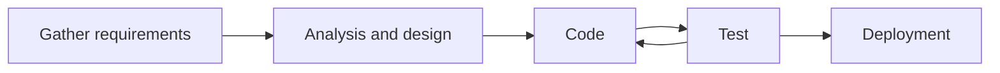
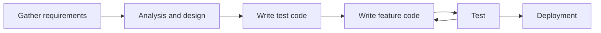

<div markdown="1">

## Download Link

[**App Store**](https://apps.apple.com/kr/app/ara-for-kaist/id6457209147)

[**Google Play**](https://play.google.com/store/apps/details?id=org.sparcs.newara)

[**GitHub Repository**](https://github.com/sparcs-kaist/new-ara-app)

## 1. Key Implementation Requirements

[The web-based Ara frontend and backend have been in service since 1991.](https://sparcs.org/projects/ara/) However, there was no **mobile app** for Ara, so I developed one.

<div style="display: flex">


</div>

<div style="display: flex">


</div>

- **Login Logic**: Integrate KAIST SSO authentication so that only KAIST students can log in.
- **Post Viewing**: Users should be able to view posts organized by boards

- **Post Creation and Editing**: Users can add and edit posts in HTML format, with support for attachments.
- **Comments**: Enable users to comment on posts.

- **Multilingual Design**: The interface should support both English and Korean.

## 2. Why do I choose Flutter to implement a mobile app.

### 2.1 Pros

- **Previous Experience**: My co-worker [Sang-oh Kim](https://github.com/sangohkim) and I have some familiarity with Flutter.

- **Cross-Platform**: Since the app needs to be available on both iOS and Android, Flutter is a good option.

### 2.2 Cons

- **Not Native app**: Using advanced and the latest native features can be challenging. I rely solely on the Flutter SDK and its latest updates.

- **Relatively Small Flutter Community**: Fewer available libraries and community resources.

## 3. Structure

### 3.1 Code

```
NEW-ARA-APP
├── ios
│   ├── ...
│   └── fastlane
│       ├── Appfile
│       ├── Fastfile
│       ├── README.md
│       └── report.xml
├── android
│   ├── ...
│   └── fastlane
│       ├── Appfile
│       ├── Fastfile
│       ├── README.md
│       ├── newara-fastlane.json
│       ├── report.xml
│       └── upload-keystore.jks
├── assets
│   ├── fonts
│   │   └── ...
│   ├── icons
│   │   └── ...
│   ├── images
│   │   └── ...
│   └── translations
│       ├── en.json
│       └── ko.json
└── lib
    ├── constants
    │   ├── colors_info.dart
    │   └── ...
    ├── main.dart
    ├── models
    │   ├── article_list_action_model.dart
    │   └── ...
    ├── pages
    │   ├── board_list_page.dart
    │   └── ...
    ├── providers
    │   ├── user_provider.dart
    │   └── ...
    ├── translations
    │   ├── codegen_loader.g.dart
    │   └── locale_keys.g.dart
    ├── utils
    │   ├── cache_function.dart
    │   └── ...
    └── widgets
        ├── border_boxes.dart
        └── ...
```

- **CI/CD** is managed by GitHub Actions and [fastlane](https://docs.fastlane.tools/getting-started/cross-platform/flutter/). Deployment keys, such as .jks files, are securely stored in GitHub Secrets.
- **assets/**: It is composed of images, fonts, and translations.
- **lib/models/**: It defined the schemas for API requests and response.
- **lib/pages/**: It contains the structure of pages displayed in the app.
- **lib/providers/**: [Provider](https://pub.dev/packages/provider) is official state management libraries. Each dart file manages an entity's state.
- **lib/widgets/**: It contains reusable, common widgets.

### 3.2 Provider

I used the Provider library to share the same instance across the entire app. It seems like a singleton pattern, but it can also use dependency injection.

**Sample**

```dart
import 'package:flutter/material.dart';
import 'package:provider/provider.dart';
import 'cart_provider.dart';
import 'cart_screen.dart';

void main() {
    runApp(MyApp());
}

class MyApp extends StatelessWidget {
    @override
    Widget build(BuildContext context) {
        return MaterialApp(
            home: MultiProvider(
                providers: [
                    ChangeNotifierProvider(create: (_) => CartProvider()),
                ],
                child: CartScreen(), // CartProvider is only available for CartScreen and its widget tree
            ),
        );
    }
}
```

### 3.3 Role

We divide roles by features.

- [Sang-oh Kim](https://github.com/sangohkim): Responsible for implementing the comment writing system, personal profile editing, scrap system, and CI/CD.
- [Me](https://github.com/skykhs3): Responsible for implementing the post and board view system, login system, and post writing system.

## 4. How to implement login

The login page is composed of a [Web View](https://pub.dev/packages/webview_flutter). To use Ara app, users must log in through the SPARCS SSO web page, which serves as a club-based SSO system.

SPARCS SSO authenticates by storing cookies in the web browser, making a WebView essential. This includes cookies like csrftoken and sessionId for user authentication and session maintenance.

Interestingly, Flutter allows access to WebView cookies, which could pose a security risk. I’ll address why the authority of cookies is important at a later time.

## 5. Post Creation and Editing

## 6. Post Viewing

## 7. Trouble shooting with app store and play store

## 8. CI/CD

To be written...

<!-- ### withdrawal
### 익명 정책
### 테스터의 도배 -->

## 9. Points to improve

After finishing the project, I identified several missing points and learned the following development considerations.

### 9.1 MVC

If I were to implement the code again, I would solidify the **MVC (Model-View-Controller)** pattern. However, current code is mixed within dart files in a page folder. I would restructure it as shown below.

```
lib/
├── main.dart
├── models/
│   ├── user_model.dart
│   └── product_model.dart
├── views/
│   ├── home_view.dart
│   ├── login_view.dart
│   └── widgets/
│       ├── custom_button.dart
│       └── product_card.dart
├── controllers/
│   ├── user_controller.dart
│   └── product_controller.dart
├── api_service/
│   ├─  schemas.dart
│   └── dio.dart
└── utils/
    ├── constants.dart
    └── helpers.dart

```

- **models/**: It stores data and state of the app.
- **views/**: It is directly related with UI of the app.
- **controllers/**: It overrides [ChangeNotifier](https://api.flutter.dev/flutter/foundation/ChangeNotifier-class.html) and controls data of models. When the model changes, controllers call `notifyListeners()` and update the views.
- **api_service/**: It defines schemas of API and API functions.

### 9.2 Code Push

Flutter doesn’t support Code Push, which means updating the app takes **too long due to app store review processes**. This is a key reason that new team members are migrating it to React Native, as Code Push would allow immediate updates without a cumbersome review.

### 9.3 Native App needed to run in apple watch

If I want to implement app for Apple watch, eventually I have to implement swift code. I noticed that sophisticated app required native code.

### 9.4 TDD (Test-Driven Development)

**Waterfall**

It’s challenging to find bugs in the app. Our app follows a development cycle like the graph below:



**TDD**

While TDD (Test-Driven Development) isn’t absolutely essential, it could be beneficial for effectively catching bugs and organizing features more clearly.



</div>
