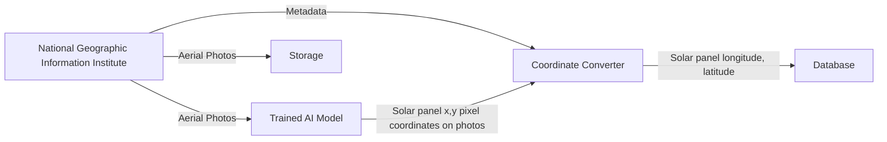
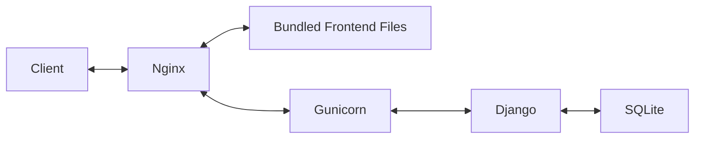

## 1. Overview
   
We proposed the project called **"Solar-See"**. "Solar-See" is an AI-based game and mapping service developed to identify **non-metered solar panels** and improve the accuracy of **power demand forecasting**.

### Link
[**GitHub Repository**](https://github.com/techforimpact-archive/TFI_CAMPUS_KAIST_24fall_Solar-See){:target="_blank"}

[**Demo**](/assets/img/posts/2025-04-07-retrospective-kakao-impact/demo-small.mp4){:target="_blank"}

[**Presentation**](/assets/img/resume/solar_see_final_presentation.pdf){:target="_blank"}

## 2. My role and Responsibilities
I developed both the **frontend(React)** and **backend(Django)**, deployed the services(Nginx), and fine-tuned an **image segmentation model(Ultralytics YOLO11)**.

## 3. Architecture

### 3.1 Training Model

### 3.2 Pre Processing

### 3.3 Service

## 3. Tech Stacks

We chose React and Django + Django REST Framework because our team is already familiar with these technologies.

### 3.1 Django REST Framework
**Pros:**
- Many AI modules are available in Python
- Built-in ORM (Django ORM) and built-in JSON conversion (serializers)
- Auto-generated admin panel.

**Cons:**
- Limited flexibility

### 3.2 Nginx
- Its asynchronous, event-driven architecture makes it highly efficient at handling concurrent connections. It's especially fast at serving static files.

### 3.2.1 High-level features (HTTP optimizations)
**1. gzip / brotli – Compression**

These compress your static files (like HTML, CSS, JS) before sending them to the browser. 
Smaller file size = faster loading. 
brotli is newer and usually compresses better than gzip. 

**2. ETag – File version checker** 
It’s like a unique ID for each version of a file. 
If the file hasn’t changed, the browser can use the cached version instead of downloading again. 

**3. Last-Modified – Timestamp of the file** 
The browser asks: “Has this file been updated since last time?” 
If not, the server just says "No need to re-download" (sends 304 Not Modified). 

### 3.2.2 Low-level features (System-level speed boosts)
**1. sendfile – Skip the middle step** 
Normally, files go from disk → memory → network. 
With sendfile, the OS sends the file directly from disk to network. 
This saves time and CPU. 

**2. mmap – Map file into memory** 
Makes file access much faster by mapping it directly into memory. 
Useful when serving the same files repeatedly. 

**3. zero-copy I/O – No copying at all** 
It avoids copying data between parts of the system (like memory and disk). 

### 3.3 SQLite
**Pros:**

- Django supports SQLite as the default database.

- It's lightweight and file-based, making it easy to share data.

**Cons:**

- Lacks concurrency support. Only one process can modify the database at a time.

- As a serverless RDBMS, it cannot be accessed directly from external networks.

### 3.4 Ultralytics
**Pros:**

- If the training data is well-labeled, fine-tuning can be done easily with just a few commands.
- This framework has good pre-trained models.

### 3.4.1 How to fine-turn model?
To be written...

## 4. Gunicorn?? It's weird for me.

This was my first time using Django, and **I initially didn’t understand why a separate component like Gunicorn was needed for deployment**.
In Node.js, I was used to creating standalone HTTP servers, so simply porting it behind Nginx was enough.

However, Django introduces a unique concept: the separation between the **WSGI (Web Server Gateway Interface) server** and the **WSGI(web server gateway interface) application**

## 4.1 WSGI Server, WSGI Application

- The WSGI application handles business logic.

- The WSGI server is responsible for multiprocessing and threading.

This separation of concerns is a good design principle. It allows the WSGI application to be swapped out easily (e.g., from WSGI to ASGI).

## 4.2  Node.js vs. Django + DRF

For example, if you want to use HTTP/2 in Node.js, you'd need to import the http2 module and change the code accordingly.
In Django, on the other hand, you just need to switch the WSGI server.

|                   | Node.js                     | Django                           |
| ----------------- | --------------------------- | -------------------------------- |
| Self-HTTP Server  | O (default built-in)        | X (external server required)     |
| Design Philosophy | Server + Runtime All-in-One | App Logic Only, Server is Needed |
| Deployment        | simple and low flexibility  | complex and high flexibility     |
