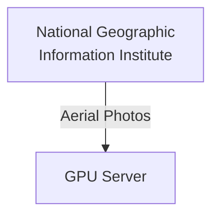
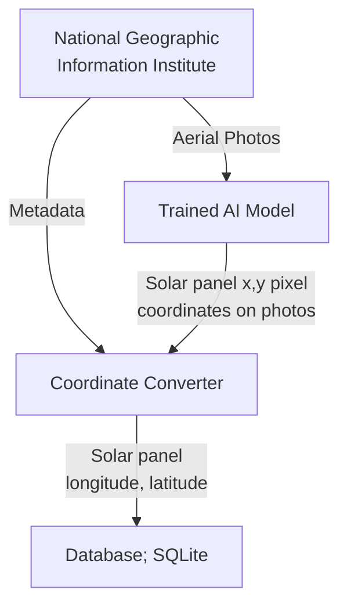
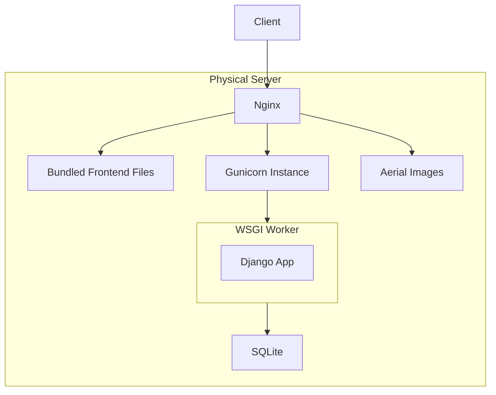
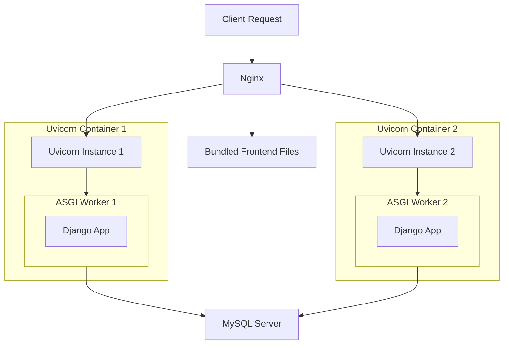

<div markdown="1">

## 1. Overview

We proposed the project called **"Solar-See"**. "Solar-See" is an AI-based game and mapping service developed to identify **non-metered solar panels** and improve the accuracy of **power demand forecasting**.

### Link

[**GitHub Repository**](https://github.com/techforimpact-archive/TFI_CAMPUS_KAIST_24fall_Solar-See){:target="\_blank"}

[**Presentation (KOR)**](https://cdn.jsdelivr.net/gh/skykhs3/skykhs3.github.io@main/assets/img/resume/solar-see-final-presentation.pdf){:target="\_blank"}

[**Demo (KOR)**](https://cdn.jsdelivr.net/gh/skykhs3/skykhs3.github.io@main/assets/img/posts/2025-04-07-retrospective-kakao-impact/demo-small.mp4){:target="\_blank"}

## 2. My role and Responsibilities

I developed both the **frontend(React)** and **backend(Django)**, deployed the services(Nginx), and fine-tuned an **image segmentation model(Ultralytics YOLO11)**.

## 3. Architecture

### 3.1. Training Model



### 3.2. Pre Processing



### 3.3. Service



## 4. Django REST Framework
We chose React and Django + Django REST Framework because our team is already familiar with these technologies. We saved over 50GB of images for training the model and developing the service.


**Pros:**

- Many AI modules are available in Python
- Built-in ORM (Django ORM) and built-in JSON conversion (serializers)
- Auto-generated admin panel.

**Cons:**

- Limited flexibility

## 5. Nginx

- Its asynchronous, event-driven architecture makes it highly efficient at handling concurrent connections. It's especially fast at serving static files.

#### 5.1. High-level features (HTTP optimizations)

**1. gzip / brotli – Compression**

These compress your static files (like HTML, CSS, JS) before sending them to the browser.<br/>
Smaller file size = faster loading.<br/>
brotli is newer and usually compresses better than gzip.<br/>

**2. ETag – File version checker**<br/>
It's like a unique ID for each version of a file.<br/>
If the file hasn't changed, the browser can use the cached version instead of downloading again.<br/>

**3. Last-Modified – Timestamp of the file**<br/>
The browser asks: "Has this file been updated since last time?"<br/>
If not, the server just says "No need to re-download" (sends 304 Not Modified).<br/>

#### 5.2. Low-level features (System-level speed boosts)

**1. sendfile – Sends files faster**<br/>
Normally, files go from `disk → kernel buffer → user buffer → network`.<br/>
With sendfile, they go from `disk → kernel buffer → network`.<br/>
Zero-copy I/O – No copying at all: This saves time and CPU.<br/>

**2. mmap – Reads and analyzes files faster**<br/>
Makes file access much faster by mapping it directly into memory.<br/>
Useful when serving the same files repeatedly.<br/>

> ```c
> char buf[4096];
> read(fd, buf, 4096);
> ```
> **read() system call; Slow** <br/>
> `Disk → Kernel Buffer → User Buffer` <br/>
> User reads from user buffer <br/>
> 
> ---
> 
> ```c
> char *buf = mmap(NULL, 4096, PROT_READ, MAP_PRIVATE, fd, 0);
> ```
> **mmap() system call; Fast** <br/>
> mmap reserves memory in user address space and maps it to the file.
> When user accesses the address, page fault occurs and data is loaded from disk to user memory.
{: .prompt-info}


## 6. SQLite

**Pros:**

- Django supports SQLite as the default database.

- It's lightweight and file-based, making it easy to share data.

**Cons:**

- Lacks concurrency support. Only one process can modify the database at a time.

- As a serverless RDBMS, it cannot be accessed directly from external networks.

## 7. Ultralytics

**Pros:**

- If the training data is well-labeled, fine-tuning can be done easily with just a few commands.
- This framework has good pre-trained models.

### 7.1. How to fine-tune model?


*Object Detection Predictions During Batch Training*

**To be written...**

## 8. Gunicorn?? It's weird for me.

This was my first time using Django, and **I initially didn't understand why a separate component like Gunicorn was needed for deployment**.
In Node.js, I was used to creating standalone HTTP servers, so simply porting it behind Nginx was enough.

However, Django introduces a unique concept: the separation between the **WSGI (Web Server Gateway Interface) server** and the **WSGI(web server gateway interface) application**

### 8.1. WSGI Server, WSGI Application

- The WSGI application handles business logic.

- The WSGI server is responsible for multiprocessing and threading.

This separation of concerns is a good design principle. It allows the WSGI application to be swapped out easily (e.g., from WSGI to ASGI).

### 8.2. WSGI Server vs ASGI Server

|Feature | Synchronous (WSGI)| Asynchronous (ASGI)|
| --- | ---| --- |
| Execution Model | Blocking (one request at a time per worker/thread) | Non-blocking (can handle many requests concurrently)  |
| Concurrency | Thread/process-based concurrency | Event loop-based concurrency (async/await) |
| Protocol Support | HTTP only | HTTP, WebSocket, and more |
| Server Examples | Gunicorn, uWSGI, mod\_wsgi | Uvicorn, Daphne, Hypercorn |

### 8.3. Node.js vs Django + DRF

For example, if you want to use HTTP/2 in Node.js, you'd need to import the http2 module and change the code accordingly.
In Django, on the other hand, you just need to switch the WSGI server.

|                   | Node.js                     | Django                           |
| ----------------- | --------------------------- | -------------------------------- |
| Self-HTTP Server  | O (default built-in)        | X (external server required)     |
| Design Philosophy | Server + Runtime All-in-One | App Logic Only, Server is Needed |
| Deployment        | simple and low flexibility  | complex and high flexibility     |

### 8.4. Spring Boot Application vs Django + DRF

| Concept                    | Spring Boot Application                                   | Django                                                      |
| -------------------------- | --------------------------------------------------------- | ----------------------------------------------------------- |
| Web Application            | Spring Boot application                                   | Django project                                              |
| Web Server / HTTP Handler  | Embedded Tomcat (included by default)                     | External Gunicorn (requires separate setup)                 |
| Request Handling & Routing | Tomcat receives HTTP requests and forwards them to Spring | Gunicorn receives HTTP requests and forwards them to Django |
| Replaceable?               | Can be replaced with Jetty, Undertow, etc.                | Can be replaced with uWSGI, Daphne, etc.                    |

## 9. Points to improve

The project ended with the development of an MVP without considering scenarios with many users. If there are many users, each service will be converted into a container and the following architecture will be considered:

- SQLite → MySQL: Because SQLite cannot handle multiple file writing
- Two servers: At least two servers are needed to prevent server downtime



</div>
