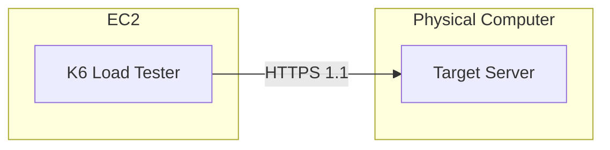
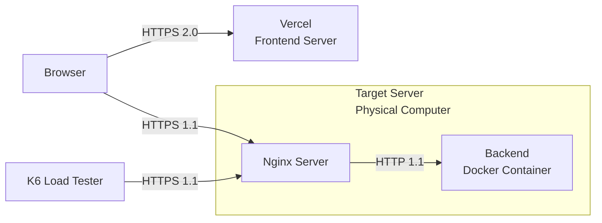
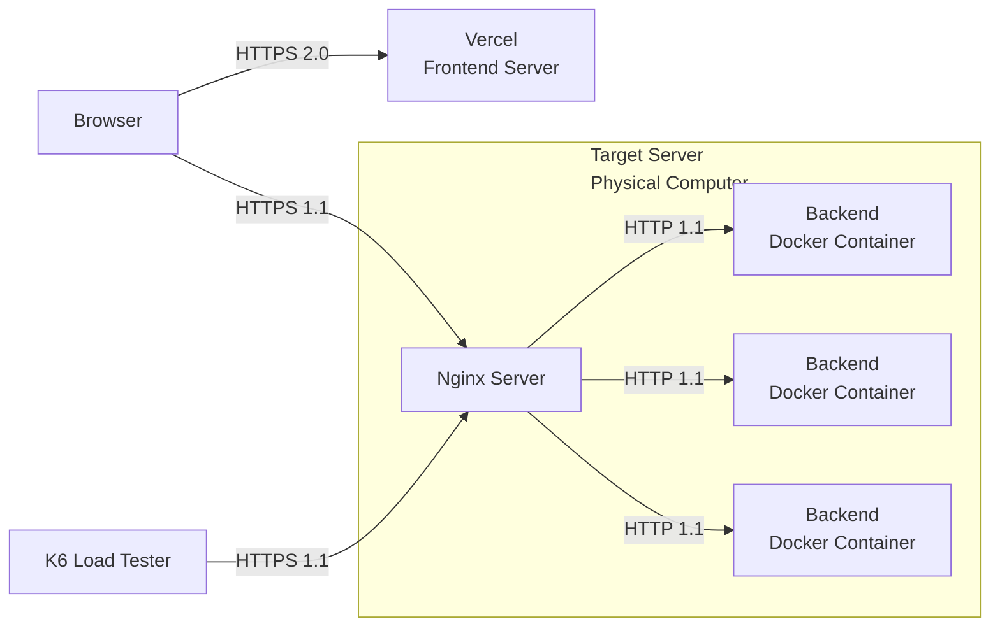

## 1. Grafana K6

[Grafana K6](https://grafana.com/docs/k6/latest/using-k6/http-requests/){:target="_blank"} is a load testing tool that helps you identify server limitations. I chose Grafana K6 as a load tester because I can easily implement a test in JavaScript. With Grafana K6, I will find the bottleneck of my server and increase its throughput.

I needed a server on another private network, so I used [AWS EC2](https://docs.aws.amazon.com/AWSEC2/latest/UserGuide/concepts.html){:target="_blank"} as K6 server



## 2. Current Status of Target Server (My Server)

[Live Website](https://kaist.vercel.app){:target="_blank"}

[Github](https://github.com/skykhs3/project-is-server-down){:target="_blank"}

### 2.1. Server Specs


```bash
ubuntu@server 
------------- 
OS: Ubuntu 24.04.2 LTS x86_64 
Host: ChiefRiver Platform 0.1 
Kernel: 6.11.0-25-generic 
Uptime: 1 day, 1 hour, 19 mins 
Packages: 2240 (dpkg), 13 (snap) 
Shell: bash 5.2.21 
Resolution: 1366x768 
Terminal: node 
CPU: Intel i5-3337U (4) @ 2.700GHz 
GPU: Intel 3rd Gen Core processor Graphics Controller 
Memory: 2267MiB / 7779MiB 
```

### 2.2. Structure

<details markdown="1">
<summary>
/etc/nginx/nginx.conf
</summary>
```conf
user  nginx;
# Use 'auto' to spawn one worker per CPU core for maximum parallelism
worker_processes  auto; 

error_log  /var/log/nginx/error.log notice;
pid        /run/nginx.pid;

# Raise per-worker file descriptor limit to 200k to handle high numbers of open connections and files (OS level)
worker_rlimit_nofile 200000; 

events {
    use epoll;
    #Allow each worker to handle up to 10,240 simultaneous connections
    worker_connections  10240;
    # Enable accepting multiple new connections at once to improve throughput under load
    multi_accept on;  
}

http {
    include       /etc/nginx/mime.types;
    default_type  application/octet-stream;

    client_max_body_size 100G;

    log_format  main  '$remote_addr - $remote_user [$time_local] "$request" '
                      '$status $body_bytes_sent "$http_referer" '
                      '"$http_user_agent" "$http_x_forwarded_for"';

    access_log  /var/log/nginx/access.log  main;

    sendfile        on;
    tcp_nopush     on;
    keepalive_timeout  65;

    gzip  on;
    gzip_vary on;
    gzip_proxied any;
    gzip_comp_level 6;
    gzip_types text/plain text/css text/xml application/json application/javascript application/xml+rss application/atom+xml image/svg+xml;

    include /etc/nginx/sites-enabled/*;
}

```
</details>

<details markdown="1">
<summary>
/etc/nginx/site-enabled/server.conf
</summary>
```conf
upstream project-is-it-down-api {
  server 127.0.0.1:1025;
  keepalive 128;
}

server {
  server_name api.kaist.techceo.kr;
  location / {
        proxy_pass http://project-is-it-down-api;
        proxy_http_version 1.1;
        proxy_set_header Upgrade $http_upgrade;
        proxy_set_header Connection 'upgrade';
        proxy_set_header Host $host;
        proxy_cache_bypass $http_upgrade;
    }

    listen 443 ssl; # managed by Certbot
    ssl_certificate /etc/letsencrypt/live/api.kaist.techceo.kr/fullchain.pem; # managed by Certbot
    ssl_certificate_key /etc/letsencrypt/live/api.kaist.techceo.kr/privkey.pem; # managed by Certbot
    include /etc/letsencrypt/options-ssl-nginx.conf; # managed by Certbot
    ssl_dhparam /etc/letsencrypt/ssl-dhparams.pem; # managed by Certbot
}

server {
    if ($host = api.kaist.techceo.kr) {
        return 301 https://$host$request_uri;
    } # managed by Certbot


    server_name api.kaist.techceo.kr;
    listen 80;
    return 404; # managed by Certbot
}
```
</details>


**Currently, only one container exists.**



## 3. Grafana K6 Server

### 3.1. Server Specs (AWS t3a.small)
```
ubuntu@ip-172-31-35-93 
---------------------- 
OS: Ubuntu 24.04.2 LTS x86_64 
Host: t3a.small 
Kernel: 6.8.0-1024-aws 
Uptime: 2 hours, 23 mins 
Packages: 763 (dpkg), 4 (snap) 
Shell: bash 5.2.21 
Resolution: 800x600 
Terminal: /dev/pts/0 
CPU: AMD EPYC 7571 (2) @ 2.199GHz 
GPU: 00:03.0 Amazon.com, Inc. Device 1111 
Memory: 216MiB / 1916MiB 
```

### 3.2. Test Code

```bash
K6_WEB_DASHBOARD=true k6 run script.js
```

```javascript
import http from 'k6/http';
import { sleep } from 'k6';

export const options = {
  stages: [
    // Ramp up to 1000 virtual users over 10 minutes
    { duration: '10m', target: 1000 }
    //{ duration: '10m', target: 2000 }
  ],
};

export default function (){
  http.get('https://api.kaist.techceo.kr/api/server-status',{      
    headers:{
      'Origin':'https://kaist.vercel.app'
    },
    timeout: '10000s'
  });
  
  // Simulate real user behavior by adding a delay between requests
  sleep(1);
}
```

> You need to open port 5665 on EC2 and [Security Group](https://docs.aws.amazon.com/vpc/latest/userguide/vpc-security-groups.html){:target="_blank"} to access the web dashboard
{: .prompt-warning}

## 4. [Test Results](/assets/img/posts/2025-05-07-load-testing/k6-report-container1.html){:target="_blank"}


- Throughput: peaking at ~350 RPS
- Latency: average ~1.5 seconds, 95th percentile ~1.2 seconds, 99th percentile ~1 minute

## 5. What is the bottleneck of the server?
### 5.1. Network?

*Network Speed*

> - The maximum network speed is sufficient to handle 66 Mbps at peak times.
{: .prompt-tip}

### 5.2. Database?
```typescript
let start = Date.now();
// ...get documents with mongodb and save to in-memory cache
duration[0] = Date.now() - start;
start = Date.now();
// ...get documents with mongodb and save to in-memory cache
duration[1] = Date.now() - start;
logger.info(`Data fetch duration: ${duration[0]}ms, ${duration[1]}ms`);
```

*DB Latency*

> Database fetching is not the bottleneck.
> - It only takes 20 to 40 ms.
> - I implemented this as a cron job.
> - The total size of the documents in the collection is always the same (220MB).
{: .prompt-tip}

### 5.3. Nginx?
```conf
http {
  log_format  main_timing  '$remote_addr - $remote_user [$time_local] "$request" '
                          '$status $body_bytes_sent "$http_referer" '
                          '"$http_user_agent" "$http_x_forwarded_for" '
                          'rt=$request_time '
                          'urt=$upstream_response_time '
                          'uct=$upstream_connect_time '
                          'uht=$upstream_header_time '
                          'ua=$upstream_addr';
  ...

```
The difference between `rt` and `urt` represents the Nginx overhead, and `urt` represents the application overhead.


*Nginx Latency*

> There is **no nginx overhead**.
{: .prompt-tip}

### 5.4. Application?
```bash
top
```


> **A Node.js process is the cause of the bottleneck!** The Node.js process is using 100% of a single CPU core, but it cannot utilize more than that. This is because Node.js is single-threaded. In other words, a single Express.js application can only use one CPU core.
{: .prompt-warning}

## 6. How I changed it to improve
### 6.1. Increasing the number of backend containers

#### 6.1.1. Improvements



#### 6.1.2. Results

[Test results when there are two backend containers](/assets/img/posts/2025-05-07-load-testing/k6-report-container2.html){:target="_blank"}

[Test results when there are three backend containers](/assets/img/posts/2025-05-07-load-testing/k6-report-container3.html){:target="_blank"}


*Lef: one backend containers set up<br/>Mid: two backend containers set up<br/>Rig: three backend containers set up*

The throughput showed a **linear relationship** with the increasing number of containers, **but it did not increase exactly two or three times.**

---

```bash
top
```


*CPU status monitoring when there are **two** backend containers*


*CPU status monitoring when there are **three** backend containers*

I also confirmed that each container uses 100% of each core.

### 6.2. Decreasing CPU-heavy operations in application level
#### 6.2.1. Improvements
CPU-intensive operations include functions such as JSON.stringify(obj), JSON.parse(str), structuredClone(obj), lodash.cloneDeep(obj), array.sort(), and array.map(). In my Express.js backend code, I simply pre-processed the result of JSON.stringify(obj).

```typescript
//let cachedData: AllServerStatus = {};
let cachedDataStr: string;

/// cronJob to fetch database data.
...
///

app.get("/api/server-status", async (req: Request, res: Response) => {
  //res.status(200).json(cachedData);
  res.status(200).send(cachedDataStr);
});
```

#### 6.2.2 Results

[Test results when Cpu-Heavy Operation is optimized](/assets/img/posts/2025-05-07-load-testing/stringify.html){:target="_blank"}


*CPU status monitoring when CPU-heavy operations are optimized*

> The performance has improved dramatically. The server can now handle **1,500 requests per second**.
{: .prompt-info}

---

```bash
glances
```

*Burning my computer...*

> The glances command gives more specific status information about the server than the top command, but it uses more resources.
{: .prompt-tip}

### 6.3. Changing from HTTPS 1.1 to HTTPS 2.0 can improve performance?
#### 6.3.1. Improvements
```conf
server {
  server_name api.kaist.techceo.kr;
  location / {
        proxy_pass http://project-is-server-down-api;
        proxy_http_version 1.1;
        proxy_set_header Upgrade $http_upgrade;
        proxy_set_header Connection 'upgrade';
        proxy_set_header Host $host;
        proxy_cache_bypass $http_upgrade;
    }

    #listen 443 ssl;
    listen 443 ssl http2;
...
```


#### 6.3.2. Results
[Test results when http2 set up](/assets/img/posts/2025-05-07-load-testing/http2.html){:target="_blank"}

> There is no performance difference between https 1.1 and https 2.0.
{: .prompt-info}


## 7. Conclusion


*Vecel Web Analytics: Real Visitors*

It's user traffic that doesn't require load testing, but it was nice to take this opportunity to study load testing.

